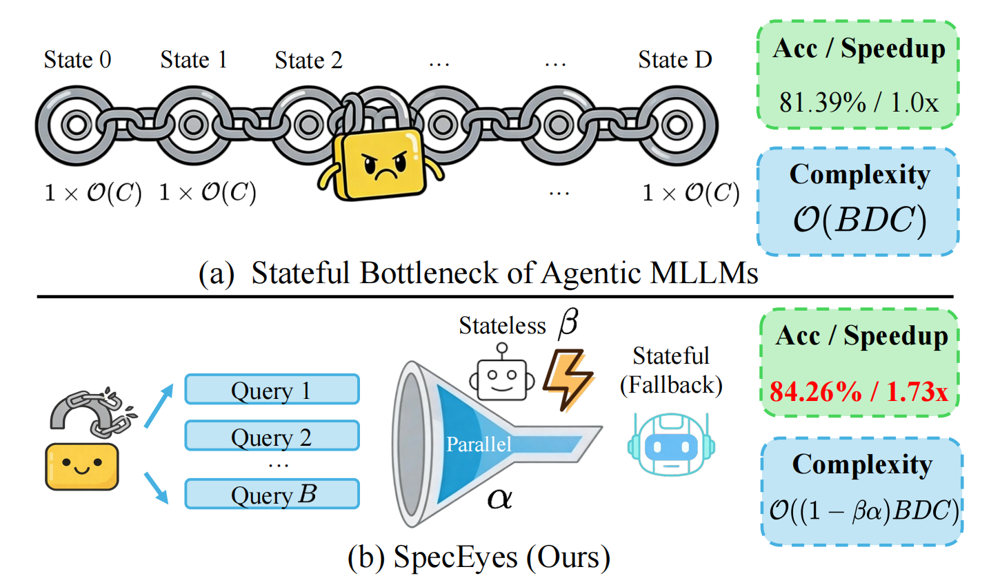

<h2 align="center">SpecEyes: Accelerating Agentic Multimodal LLMs via Speculative Perception and Planning</h2>


<p align="center">
  <a href="#Highlights">Highlights</a> ·
  <a href="#main-results">Main Results</a> ·
  <a href="#environment-setup">Environment Setup</a> ·
  <a href="#quick-start">Quick Start</a> ·
  <a href="#repository-structure">Repository Structure</a> ·
  <a href="#acknowledgements">Acknowledgements</a> ·
  <a href="#license">License</a> ·
  <a href="#citation">Citation</a>
</p>

SpecEyes is a speculative perception and planning framework for agentic multimodal LLMs. It uses a lightweight vision-language model to quickly assess a visual input and question, then applies answer separability gating to either accept the fast answer or defer to a more powerful large model with tool usage. This approach significantly reduces latency and computation in complex multimodal reasoning while maintaining strong accuracy. This repository includes evaluation code, judge scripts, confidence analysis, and result aggregation tools for SpecEyes.

<a id="Highlights"></a>
## 1. Highlights ✨
<p align="center">

</p>

| Direction | Description |
| --- | --- |
| Stateful Bottleneck Analysis | Reveal the sequential tool-use dependency limiting latency and concurrency in agentic MLLMs. |
| Agentic-Level Speculation | Propose speculative reasoning that skips full tool invocation loops for easy queries. |
| Answer Separability Gating | Introduce a new confidence metric based on top-K logit gaps to decide safe bypass. |

<a id="environment-setup"></a>
## 2. Environment Setup 🛠️

We recommend `Python 3.11`. Install the PyTorch build matching your CUDA version first, then install the project requirements:

```bash
pip install -r requirements.txt
```

Recommended optional packages:

- `flash-attn`: useful for higher throughput on supported GPUs
- `vllm==0.12.0`: recommended in a separate environment for the judge model service

This repository also relies on a patched image-loading behavior in `qwen-vl-utils`. After installing `qwen-vl-utils`, run:

```bash
python scripts/patch_qwen_vl_utils.py
```

<a id="quick-start"></a>
## 3. Quick Start 🚀

### 3.1 Prepare Datasets and Models

Download the datasets and models into the following directories, or pass explicit paths at runtime:

- [V*](https://huggingface.co/datasets/craigwu/vstar_bench/tree/main): `data/vstar`
- [HR-Bench](https://huggingface.co/datasets/DreamMr/HR-Bench/tree/main): `data/HR-Bench`
- [POPE](https://huggingface.co/datasets/lmms-lab/POPE/tree/main): `data/POPE`
- [Deepeyes](https://huggingface.co/ChenShawn/DeepEyes-7B): `ChenShawn/DeepEyes-7B`
- [Thyme](https://huggingface.co/Kwai-Keye/Thyme-RL): `Kwai-Keye/Thyme-RL`
- [Qwen3-VL-2B](https://huggingface.co/Qwen/Qwen3-VL-2B-Instruct): `Qwen/Qwen3-VL-2B-Instruct`
- [Qwen2.5-72B](https://huggingface.co/Qwen/Qwen2.5-72B-Instruct): `Qwen/Qwen2.5-72B-Instruct`

### 3.2 Run the Main Evaluation

```bash
# Deepeyes baseline
python eval_code_deepeyes/SpecEyes.py --baseline

# Deepeyes with confidence gating
python eval_code_deepeyes/SpecEyes.py --score_threshold 0.98

# Thyme baseline
python eval_code_thyme/SpecEyes.py --baseline

# Thyme with confidence gating
python eval_code_thyme/SpecEyes.py --score_threshold 0.98
```

For the code-reasoning variant, replace `SpecEyes.py` with `SpecReason.py`.

### 3.3 Start the Judge Model

```bash
bash scripts/start_qwen2.5_72b_vllm.sh
```

The default judge endpoint is `http://localhost:23333/v1`. Override it with `--api_url` if needed.

### 3.4 Run the Judge Scripts

```bash
bash scripts/run_judges.sh
```

You can also run them manually:

```bash
python judge_code/judge_vstar.py --input_folder eval_results_qwen3vl-2b-Instruct
python judge_code/judge_hr.py --input_folder eval_results_qwen3vl-2b-Instruct
python judge_code/judge_pope.py --input_folder eval_results_qwen3vl-2b-Instruct
```

### 3.5 Analyze Small-Model Confidence

```bash
# Run batched small-model inference
python scripts/small_model_batch_inference.py

# Judge the generated outputs
python judge_code/judge_vstar.py --input_folder eval_results_qwen3vl-2b-Instruct
python judge_code/judge_hr.py --input_folder eval_results_qwen3vl-2b-Instruct

# Analyze judge results
python scripts/analyze_small_confidence.py --input_folder judge_results_qwen3vl-2b-Instruct
python scripts/analyze_small_conf_percentage.py --input_folder judge_results_qwen3vl-2b-Instruct
```

<a id="repository-structure"></a>
## 4. Repository Structure 🗂️

```text
SpecEyes/
├── data/
│   ├── vstar/
│   ├── HR-Bench/
│   └── POPE/
├── eval_code_deepeyes/
├── eval_code_thyme/
├── judge_code/
├── scripts/
├── vis/
├── eval_results_deepeyes/
├── eval_results_thyme/
└── ...
```

Core directories:

| Path | Description |
| --- | --- |
| `eval_code_deepeyes/` | `SpecEyes` and `SpecReason` evaluation code built on Deepeyes |
| `eval_code_thyme/` | `SpecEyes` and `SpecReason` evaluation code built on Thyme |
| `judge_code/` | Judge scripts using a vLLM OpenAI-compatible endpoint |
| `scripts/small_model_batch_inference.py` | Batched small-model inference and confidence signal export |
| `scripts/gather_result.py` | Aggregation of speedup, and accuracy results |
| `scripts/analyze_small_confidence.py` | Confidence-distribution and performance analysis |
| `vis/` | Plotting and visualization utilities used in the paper |

Additional notes:

- `eval_code_thyme/sandbox.py` is a localized sandbox copy used by the Thyme evaluation pipeline
- Temporary processed images are written to `eval_code_thyme/temp_processed_images/`
- Result folders and cache directories are intentionally excluded through `.gitignore`

<a id="acknowledgements"></a>
## 5. Acknowledgements 🙏

This repository benefits from code references from the [DeepEyes](https://github.com/Visual-Agent/DeepEyes) repository. We sincerely thank the authors and maintainers for their open-source contributions, which helped inform parts of our implementation and experimentation workflow.

<a id="license"></a>
## 6. License ⚖️

This repository is released under `Apache-2.0`. See `LICENSE` for the full license text.

The repository also includes notes about third-party code and patches, including:

- the upstream source attribution for `eval_code_thyme/sandbox.py`
- the patching behavior for `qwen-vl-utils`

See `THIRD_PARTY_NOTICES.md` for the relevant attribution and redistribution notes. If you redistribute or modify those third-party-related components, you should also follow the corresponding upstream license requirements.

<a id="citation"></a>
## 7. Citation 📚

If you use this repository, please cite the corresponding paper:

```bibtex
@article{speceyes_placeholder,
  title   = {SpecEyes},
  author  = {Author One and Author Two and Author Three},
  journal = {Placeholder Venue},
  year    = {2026}
}
```
